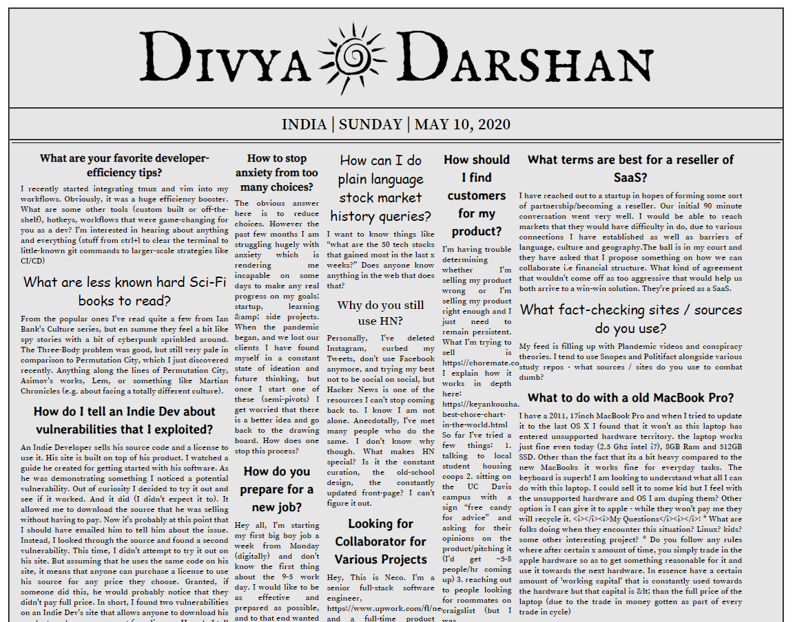

## Daily Newspaper
It uses Hacker News Api for getting the recent news of the day. The UI is designed in the way so that it resembles with the traditional newspaper. [Get the finest news of the day](https://ds-dailynewspaper.herokuapp.com/)

[](http://hits.dwyl.com/Deeksha2501/Daily-Newspaper-using-reactJS)

### Quick Overview

After downloading the project to run it on your local system run the following commands

```sh
npm install
```
## File Tree

    ```
    Daily-Newspaper
    ├── README.md
    ├── node_modules
    ├── package.json
    ├── .gitignore
    ├── .env
    ├── yarn.lock
    ├── public
    │   ├── image2.jpg
    │   ├── index.html
    │   └── manifest.json
    └── src
        ├── App.js
        ├── index.js
        ├── sun-log.png
        └── serviceWorker.js
        └── Components
        |   ├── comp-1.js
        |   ├── comp-2.js
        |   ├── comp-3.png
        |   └── comp-4.js
        |   └── comp-5
        |   ├── component.css
        |   ├── innerComp2.js
        |   ├── main-comp.js
        |   ├── upperComp.js
        └── Containers
        |   ├── storyCont.js
        └── Services
        |   ├── hacknApi.js
        └── Stories
            ├── story.js
            ├── story.css
    


### `npm start`

Runs the app in development mode.<br>
Open [http://localhost:3000](http://localhost:3000) to view it in the browser.

The page will automatically reload if you make changes to the code.<br>


## `Screenshots of the project`


<p align='center'>

</p>


## License

Create React App is open source software [licensed as MIT](https://github.com/facebook/create-react-app/blob/master/LICENSE).
